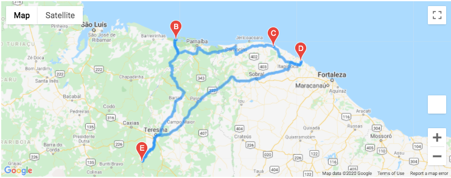

# World_Weather_Analysis

## Overview of Project

The purpose of this project was to assist a client named "Jack", the head of analysis for a hypothetical online travel company called "PlanMyTrip", in creating a method for customers visiting the site to obtain a customized travel itenerary according to their individual preferences.  The analysis allowed the customers to input their preference criteria for their trip which allowed for the retrieval of a variety of cities as well as a mapped route for their travel itineray. To perform this analysis, Python programming language was utilized to perform various decision statements with a variety of libraries and modules and to obtain API "get" requests from multiple sources. This allowed for the cities and travel itenerary from latitudinal and longitudinal coordinates to generate maps equipped with markers containing pertinent information for the customers according to their individual preferences.

---------------------------------------------
## Resources:
Data Sources: WeatherPY_Database.csv, cities.csv, 
WeatherPy_vacation.csv, Google Maps APIs, OpenWeatherMaps APIs

Software: Python 3.8.3, Visual Studio Code 1.49.2, 
Matplotlib 3.2.2, Numpy 1.18.5, Pandas 1.0.5, PySci 1.5.0,
SciPy statistics 1.5.0

---------------------------------------------

## Results:

As a result of the analysis, the use of Open Weather Mpas and Google Maps APIs contributed well to the functionality and generation of cities and maps with associated markers for the customers of PlanMyTrip.  As can be seen from the following example image in which a customer inputs a criteria of four cities localized in western Brazil, once the customer inputs a few simple preferences, the use of APIs enabled them to plan a highily organized and convenient route for their trip accordingly.

------------------------------------

-----------------------------------

## Summary

From this analysis, it is clearly evident that with the use of Python programming language and general API functionality, the flexibility of such tools can serve quite well for, not only weather data, but also the retrieval of essentially any criteria desired, so long as it is available.  In essense, we are only limited by our imagination and PlanMyTrip, in particular, now appears to be far more equipped in serving the unique travel destiantion preferences of its travel-hungry customers.

